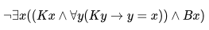

# Какие задачи решает Фреге в своей статье?

* Фреге первым ввёл термины **смысл** *(нем. **Sinn**)* и **значение** *(нем. **Bedeutung**)* и предложил различие между ними. **Значение** (современный семиотический термин – **денотат**) определённого ***(языкового)* знака** – это сама сущность предмета, *"понятная каждому, кто в достаточной степени владеет языком или совокупностью обозначений, к которым оно принадлежит"*, тогда как **смысл** (современный семиотический термин – **десигнат**) – это то, о чём хотят сказать, когда употребляют данный знак. До Фреге считалось, что у знака есть только значение, Фреге же предложил выделять ещё и смысл, продемонстрировав такой пример: в треугольнике, образованном прямыми `a`, `b` и `c` каждая вершина имеет одно и то же значение (потому что это, очевидно, одна и та же вершина), но два смысла (например *"вершина `A`"* – это то же, что и *"точка пересечения `b` и `c`"* – одно значение, но два разных смысла).
* Из этого Фреге вывел, что **значение предложения** – это его **истинностное значение**, тогда как **смысл предложения** – мысль, которая выражается этим предложением. Эти концепции он также предложил строго разделять, утверждая, что предложения могут быть одновременно истинными и бессмысленными (и наоборот, осмысленными и ложными, более того – *каждое ложное предложение является осмысленным*). 

# В чем заключается проблема информативного тождества? 

Проблема информативного тождества заключается в том, что слова или выражения, обладающие одним и тем же смыслом (т. е., указывающие на один и тот же объект), в одних контекстах (**экстенсиональных** – простых предложениях, не содержащих информации о чьих-либо психических установках, убеждённостях и т. д.) являются взаимозаменяемыми с сохранением истинного значения предложения, а в других (**интенсиональных** – сложноподчинённых предложениях либо предложениях, содержащих информацию о чьих-либо психических установках) – не являются взаимозаменяемыми с сохранением истинного значения предложения. Например, в предложении:

* *Земля – шар.*

слово *"Земля"*, очевидно, можно заменить на выражение *"третья от Солнца планета Солнечной системы"*, не потеряв при этом истинности высказывания. Но совсем другая ситуация возникает в предложении, к примеру:

* *Колумб решил, что если Земля - шар, то продвигаясь все время на запад, он сможет достичь Индии.*

Здесь при замене слова *"Земля"* выражением *"третья от Солнца планета Солнечной системы"* уже нарушается истинность. Маркеры такого контекста здесь – слово *"решил"*, придаточное с союзом *что*, обозначающее мысль, и косвенные значения слова *"Земля"*.

# Какие задачи решает Рассел в своей статье? 

Своей концепцией **обозначающих фраз** Рассел решает проблемы определения истинности сразу нескольких типов "трудных" утверждений (и их отрицаний), которые не разрешала теория Фреге.

Обозначающие фразы бывают трёх типов:

1. Обозначающая фраза не обозначает ничего (*"круглый квадрат"*).
2. Обозначающая фраза обозначает определённый объект (*"король Георг IV"*).
3. Обозначающая фраза обозначает неопределённый объект (*"какой-то король Англии"*).

* **Утверждения о несуществующих объектах  (*"Король Франции лыс"*)**

  Очевидно, что фраза *"король Франции"* имеет смысл, но не имеет значения (не соотносится ни с одним реальным объектом), соответственно, всё утверждение ложно. Истинность его отрицания, т. е., утверждения *"Король Франции не лыс"* зависит от его записи на языке формальной логики:

  *  (не существует объекта, который является королём Франции и лыс)  В этой записи утверждение *"Король Франции не лыс"* ***истинно***, потому что ***не существует объекта, который является королём Франции***.

  *   (существует объект, который является королём Франции, и он не лыс)  В этой записи утверждение *"Король Франции не лыс"* ***ложно***, потому что ***не существует объекта, который является королём Франции***.

    🙂 🙂 🙂 

    

* **Утверждения с тождествами  (*"Король Георг IV желал знать, является ли Скотт автором Уэверли"*)**

  Очевидно, что выражения *"Скотт"* и *"автор Уэверли"* в этом предложении не взаимозаменяемы, потому что иначе получается тавтология. В теории Фреге это объясняется различием смыслом при тождестве значений. Объяснение Расселла намного логичнее и изящнее: очевидно, что обозначающая фраза *"Скотт"* обозначает определённый объект, а *"автор Уэверли"* – неопределённый (то есть, *"автор Уэверли"* можно разложить на более простые составляющие, а *"Скотт"*  – нет). Тогда возможны два объяснения:

  * если фраза *"автор Уэверли"* имеет **первичное вхождение** в пропозицию, то утверждение раскладывается на *"**Один и только один человек написал Уэверли**, и Георг IV желал знать, был ли Скотт этим человеком"*
  * если фраза *"автор Уэверли"* имеет **вторичное вхождение** в пропозицию, то утверждение раскладывается на *"**Георг IV желал знать**, один ли и только ли один человек написал Уэверли и был ли этим человеком Скотт**"*

* **Утверждения о вымышленных сущностях  ("*Аполлон был сыном Зевса и Лето*")**

# На ваш взгляд, против какой позиции он выступает? 

Рассел выступает против строгого различения смысла и значения (за которое выступал Фреге), противопоставляя ему концепцию **обозначающих фраз** – фраз, которые *выражают* некоторый смысл и одновременно *обозначают* некоторое значение. Обозначающие фразы никогда не являются осмысленными *сами по себе*, но каждая пропозиция (суждение), в выражении которой они употребляются, осмысленна.